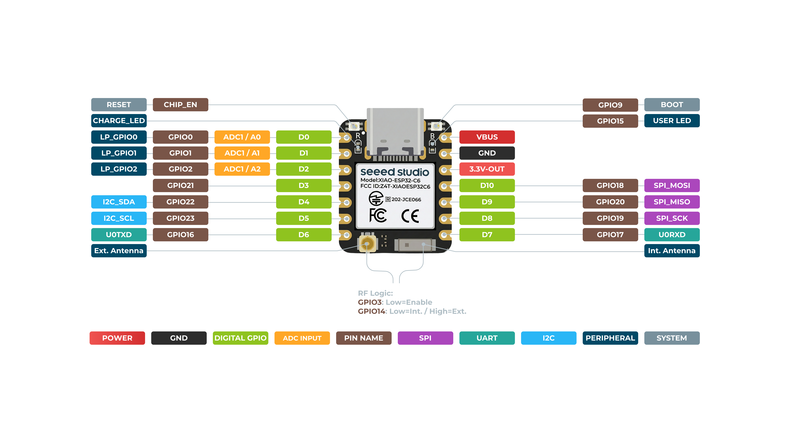
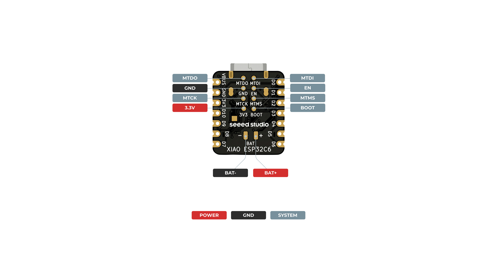

# Introdução à XIAO ESP32-C6

Guia para quem está pegando a placa pela primeira vez: como identificar os pinos, instalar o ambiente e gravar o primeiro programa. A especificação técnica completa fica no final, como referência.

Para os estudos mais avançados feitos neste repositório, veja [Zigbee](../com-zigbee/) e [Testbed de desempenho](../desempenho/).

## O que é a XIAO ESP32-C6

A XIAO ESP32-C6 é um microcontrolador do tamanho de um polegar (21 x 17,8 mm) com Wi-Fi, Bluetooth e Zigbee/Thread embutidos. É programada pelo Arduino IDE, do mesmo jeito que um Arduino comum, mas com rádio incluído: não precisa de módulo externo para colocar o projeto na rede ou para comunicar duas placas entre si.

## O que você vai precisar

- 1 placa Seeed Studio XIAO ESP32-C6
- 1 cabo USB-C **com dados** (cabos só de alimentação não gravam a placa)
- Computador com [Arduino IDE](https://www.arduino.cc/en/software) instalado

## Glossário rápido

Termos que aparecem nos pinos da placa e no resto deste guia:

| Termo | Significado |
|---|---|
| **GPIO** | *General Purpose Input/Output*, pino que pode ser ligado ou lido por software |
| **PWM** | Sinal digital que simula um valor intermediário (ex: controlar brilho de LED, velocidade de motor) |
| **ADC** | Conversor analógico-digital, lê uma tensão variável (sensores, potenciômetros) |
| **I2C** | Barramento de 2 fios (`SDA`/`SCL`) para conectar sensores e displays |
| **SPI** | Barramento de 4 fios (`MOSI`/`MISO`/`SCK`/`CS`), mais rápido que I2C |
| **UART** | Comunicação serial simples de 2 fios (`TX`/`RX`), usada também pelo Monitor Serial |
| **JTAG** | Interface de depuração de baixo nível, pouco usada em projetos básicos |

## Conheça a placa

A XIAO ESP32-C6 tem pinos nos dois lados da placa e também embaixo (bateria). As imagens abaixo mostram o que cada pino faz.

### Vista de cima



O conector **USB-C**, no topo, é usado tanto para alimentar quanto para gravar e para o Monitor Serial.

Lado esquerdo, de cima para baixo:

| Pino | Para que serve |
|---|---|
| `RESET` | Reinicia a placa (equivalente a desligar e ligar) |
| `CHARGE_LED` | LED indicador de carga da bateria |
| `D0`, `D1`, `D2` | Entradas analógicas (`A0`, `A1`, `A2`) ou digitais comuns |
| `D3` | Pino digital de uso geral |
| `D4` (SDA), `D5` (SCL) | Barramento **I2C**, para sensores e displays |
| `D6` (TX) | Saída **UART**, transmissão serial |
| conector dourado | Entrada para **antena externa** (U.FL) |

Lado direito, de cima para baixo:

| Pino | Para que serve |
|---|---|
| `GPIO9` (`BOOT`) | Mantenha pressionado ao conectar o cabo se o upload travar |
| `GPIO15` (`USER LED`) | LED embutido que pisca no roteiro de Blink |
| `VBUS` (5V) | Alimentação vinda do USB |
| `GND` | Terra |
| `3.3V-OUT` | Saída de 3,3 V para alimentar sensores |
| `D10` (MOSI), `D9` (MISO), `D8` (SCK) | Barramento **SPI** |
| `D7` (RX) | Entrada **UART**, recepção serial |
| componente redondo | **Antena interna** (já embutida na placa) |

### Vista de baixo



Embaixo da placa fica o conector de **bateria LiPo 3,7 V**: `BAT-` e `BAT+`. É opcional, a placa funciona normalmente só com o cabo USB-C. Os demais pinos (`MTDO`, `MTDI`, `MTCK`, `MTMS`, `EN`, `BOOT`, `3V3`) são os mesmos pinos de cima, vistos pelo outro lado, e usados principalmente para depuração (JTAG).

## Instalação do Arduino IDE

1. Instale o [Arduino IDE](https://www.arduino.cc/en/software) (versão 2.x).
2. Abra `File > Preferences` e, em **Additional Board Manager URLs**, cole:

   ```text
   https://espressif.github.io/arduino-esp32/package_esp32_index.json
   ```

3. Abra `Tools > Board > Boards Manager`, procure por **esp32** e instale o pacote **esp32 by Espressif Systems** (testado na versão **3.3.11** neste repositório).
4. Conecte a placa ao computador com o cabo USB-C.
5. Selecione a placa em `Tools > Board > esp32 > XIAO_ESP32C6`.
6. Selecione a porta em `Tools > Port` (`/dev/ttyACM0` no Linux, `COMx` no Windows).

> Se o upload travar em "Connecting...", mantenha o botão **BOOT** pressionado ao conectar o cabo e solte assim que o upload começar.

### Para ver o Monitor Serial

O ESP32-C6 usa USB nativo, sem chip conversor separado. Se `Serial.print()` não aparecer no Monitor Serial, habilite:

```text
Tools > USB CDC On Boot > Enabled
```

## Primeiro upload

Teste o exemplo pronto do próprio Arduino IDE:

```text
File > Examples > 01.Basics > Blink
```

Clique em **Upload**. O LED laranja (`USER LED`, `GPIO15`) deve começar a piscar. Isso confirma que a instalação e a gravação funcionaram.

## Próximos passos: roteiros básicos

Depois do Blink de teste, siga estes três roteiros, nesta ordem:

| Roteiro | O que faz | Conceitos |
|---|---|---|
| [`roteiro-01-blink/`](./roteiro-01-blink/) | Pisca o LED embutido da placa | `pinMode`, `digitalWrite`, `delay` |
| [`roteiro-02-leitura-analogica/`](./roteiro-02-leitura-analogica/) | Lê um potenciômetro/sensor e mostra o valor no Monitor Serial | `analogRead`, `Serial` |
| [`roteiro-03-botao-led/`](./roteiro-03-botao-led/) | Um botão externo liga/desliga um LED externo | `digitalRead`, entrada/saída digital |

Cada pasta tem um `readme.md` com material, montagem, como rodar e o que se espera, além do `.ino` com o código.

## Para onde ir depois

Com os três roteiros rodando, a placa já está pronta para projetos que usam o rádio:

- [Comunicação Zigbee entre duas placas XIAO](../com-zigbee/): duas placas trocando mensagens e controlando LEDs remotamente.
- [Testbed de desempenho: Wi-Fi vs ESP-NOW vs BLE vs Zigbee](../desempenho/): como medir alcance, latência e confiabilidade de cada tecnologia de rádio da placa.

## Especificação técnica (referência)

| Item | Especificação |
|---|---|
| Microcontrolador | Espressif ESP32-C6, RISC-V de 32 bits |
| Núcleo de alto desempenho | até 160 MHz |
| Núcleo de baixo consumo | até 20 MHz |
| RAM | 512 KB SRAM |
| Armazenamento | 4 MB Flash |
| Conectividade sem fio | Wi-Fi 6 (802.11ax) 2,4 GHz, Bluetooth 5.3 LE, Zigbee/Thread (IEEE 802.15.4) |
| Antena | Antena cerâmica integrada; conector U.FL para antena externa |
| Alimentação | USB-C 5 V ou bateria LiPo 3,7 V (`BAT+`/`BAT-`) |
| Consumo em deep sleep | ~15 µA |
| Dimensões | 21 x 17,8 mm |
| Temperatura de operação | -40 °C a 85 °C |
| E/S disponíveis | 11x GPIO (PWM), 7x ADC, 1x UART, 1x SPI, 1x I2C, JTAG |

## Referências

- [Seeed Studio - XIAO ESP32-C6 Getting Started (pt-BR)](https://wiki.seeedstudio.com/pt-br/xiao_esp32c6_getting_started/)
- [Espressif - Arduino core para ESP32](https://github.com/espressif/arduino-esp32)
